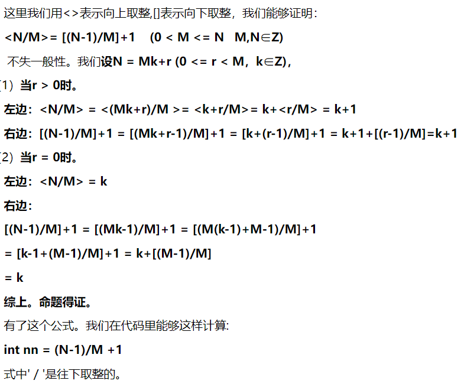
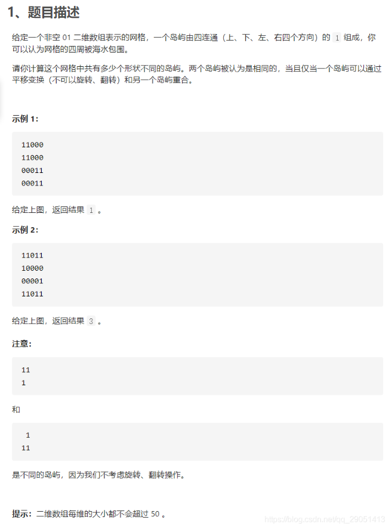

# 数组/链表：

- 23：合并k个升序链表

- 875: 爱吃香蕉的珂珂
  - 向下取整：a/b
  - 向上取整：(a - 1)/b+1
  - 

- 410: 分割数组的最大值

# 队列/栈

- 1541：平衡括号字符串的最少插入次数

# 二叉树

- 114: Deque-ArrayDeque 可以作为栈和队列使用.
  - push pop：栈，向头部添加和弹出元素
  - add poll: 队列，向尾部添加和弹出元素

- 654: 单调栈

- 297
  - 层序遍历: BFS, queue
  - 先序、中序、后序遍历: DFS, stack

- 652: 重复子树
  - 后序遍历，一边序列化一边判断重复
  - https://mp.weixin.qq.com/s/LJbpo49qppIeRs-FbgjsSQ
  ```java
    int freq = memo.getOrDefault(subTree, 0);
    // 多次重复也只会被加入结果集一次
    if (freq == 1)
        res.add(root);
    // 给子树对应的出现次数加一
    memo.put(subTree, freq + 1);
  ```

- 230: BST第k小的节点 
[题解](https://leetcode.cn/problems/kth-smallest-element-in-a-bst/solution/er-cha-sou-suo-shu-zhong-di-kxiao-de-yua-8o07/)
  - 递归，迭代
  - 记录子树节点数
  - AVL树

- 450: 删除节点
  - 无法通过函数修改变量名的引用

- 98: 是否为二叉搜索树

- 96、95: 不同的二叉搜索树

- 1373: 二叉树的二叉搜索子树的最大键值和

- 回溯

  - 797: 所有可能的路径

  - 51: n皇后: 多解，更好思路

- 排列/组合子集
  1. 排列：可能回头, 用used数组
  2. 组合子集：不能回头, currIndex, 固定相对位置以避免重复子集;
  3. 当可选的元素重复时, 排序后剪枝: 在回溯中记录preUsed, 或者 (i>0 && nums[i-1]==nums[i])
  4. 主体是数组，考虑当前的index能或者不能放这个元素

  - 698: 划分为k个相等的子集
  [题解](https://leetcode.cn/problems/partition-to-k-equal-sum-subsets/solution/zhua-wa-mou-si-by-muse-77-hytu/)

  - 40: 组合总和

  - 47: 全排列: 1,3 两点都用到

  - 39: 组合总和

  - 78: 子集（从无重复元素数组:
    问题：递归调用的时候不喜欢把index i作为条件传到下一层

  - 90: 子集（有重复元素数组

- 岛屿

  - 1020: 飞地的数量

  - 1254: 封闭岛屿的数目

  - 1905: 统计子岛屿，速度慢

  - 694: 不同岛屿的数量, 会员专享
  


- BFS

  - 752: 打开转盘锁: 
      每次往队列中添加最少的元素，在拿到新元素时就判断好是否要放进队列，否则队列长度爆炸

  - 773: 滑动谜题

  - 752: 打开转盘锁-返回打开锁的序列


- 动态规划

  - 322: 零钱兑换

  - 72: 编辑距离
      先穷举/递归，再备忘录，再自底向上

  - 300: 最长递增子序列

  - 354: 俄罗斯套娃信封

  - 10: 正则表达式匹配

- 01背包问题

  - template: 一维dp和二维dp的模板代码

  - 题解系列
    - https://leetcode.cn/problems/partition-equal-subset-sum/solution/by-flix-szk7/

  - 416: 分割等和子集

  - 474: 一和零，子集最多有m个0和n个1

  - 494: 目标和

  - 1049: 最后一块石头重量


  