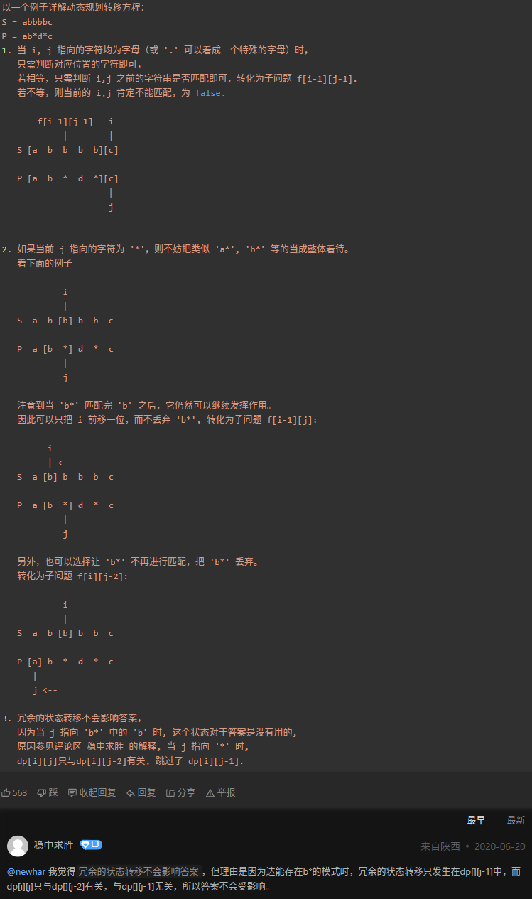

[链接](https://leetcode.cn/problem-list/2cktkvj/)

# 口诀

双指针：一快一慢，两端往中间走，中间往两端走，行不行吧？

二分：排个序，单侧加倍二分，双侧二分，中间往两边分，有没有答案？

单调栈：双侧单调栈刷一刷

哈希：万能的字典集合，不用白不用

滑动窗口：左滑一下，右滑一下，可能就过去了

递归：无论多少条数据，都可以万物归一递归下去，你就考虑一条的时候怎么整

动态规划：证明证明，我要做数学推拿

# AA_first50

## AA_twosum

哈希表

## AC_lenSubStr:

滑动窗口

- range/

## AD_midArray

二分查找的用法

## AE_longestPalindrome

回文串的解法

## AF_isMatch

字符串匹配

## AG_maxArea

双指针，缩减搜索空间

- matrix/B

- nSum/B

## AH_threeSum

双指针

## AQ_combineSum

回溯

排列时，从大到小选择，优于从小到大选择：

  从大到小选择，保证后续选择时，不会再又回头选择之前已选择过的元素；
    
  从小到大选择，则可能在选择更大元素后又回头选择小元素，造成重复

## AR_trap

dp/单调栈

- singleMax/

## 位运算

- 异或
  https://leetcode.cn/problems/single-number/solution/zhi-chu-xian-yi-ci-de-shu-zi-by-leetcode-solution/